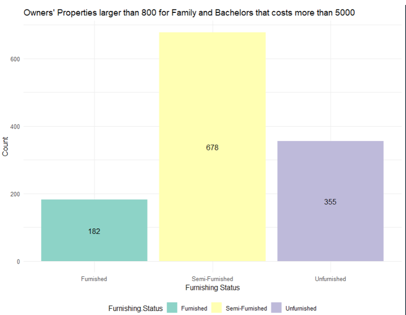
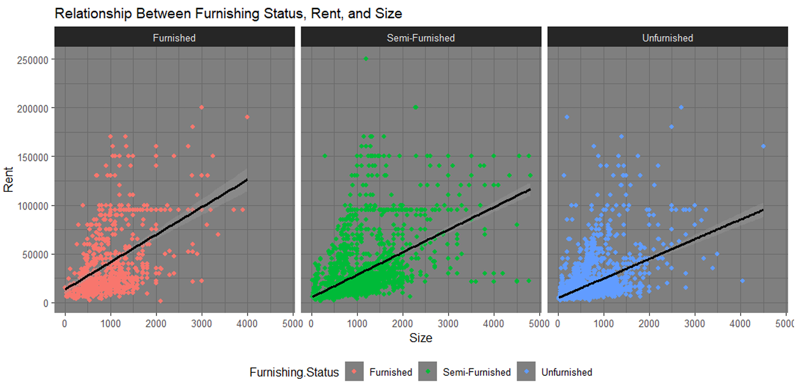

# HouseRent Dataset Analysis and Visualization

This is a HouseRent Dataset Analysis and Visualization created R programming language.

## Scenario

This dataset contains the details of varied house rents that could determine how people have an impact to choose the houses for rental based on their lifestyle. Human Rights Measurement team assigned you to perform analysis with the given dataset to identify the how people choose their rental house based on their family background, locality and lifestyle and provide meaningful insight for decision making. 

## Techniques

The dataset provided for this assignment consists of information about Houses/Apartments/Flats Available for Rent, including parameters such as BHK, Rent, Size, No. of Floors, Area Type, Area Locality, City, Furnishing Status, Type of Tenant Preferred, No. of Bathrooms, and Point of Contact. It contains over 4700 rows and 12 columns. In addition to the techniques (data exploration, manipulation, transformation, and visualization techniques) covered in the course to analyze the dataset, you might consider to explore and implement more advanced concepts to enhance the effectiveness of data retrieval.

---

## Objective

1. To find the relationship between tenant preferred and rental price.  
2. To find the impact of rent based on the furnishing status of the properties.  
3. To investigate the impact of the contact and rental price.  
3. To find the impact of property size on the rental price. 

---

## Visualization Diagram

some of the data visualization done in the project.

